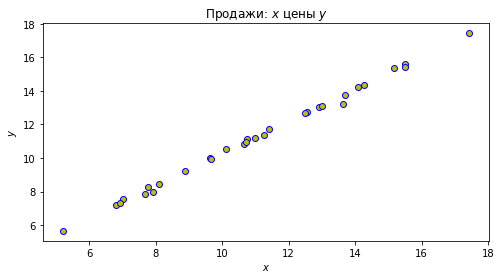

```python
# импорты
import numpy as np
import matplotlib.pyplot as plt
import pandas

# считывание данных
data = pandas.read_csv('data.csv')

# задаем координаты
x = data_frame["Weight"].tolist()
y = data_frame["Volume"].tolist()
data = np.column_stack((x, y))

# строим систему координат
fig, (ax1) = plt.subplots(
    nrows=1, figsize=(8, 4)
)

# накидываем красоты (=)
ax1.scatter(x=x, y=y, marker='o', c='y', edgecolor='b')
ax1.set_title('Продажи: $x$ цены $y$')
ax1.set_xlabel('$x$')
ax1.set_ylabel('$y$')
 
plt.show()
```





```python

```
